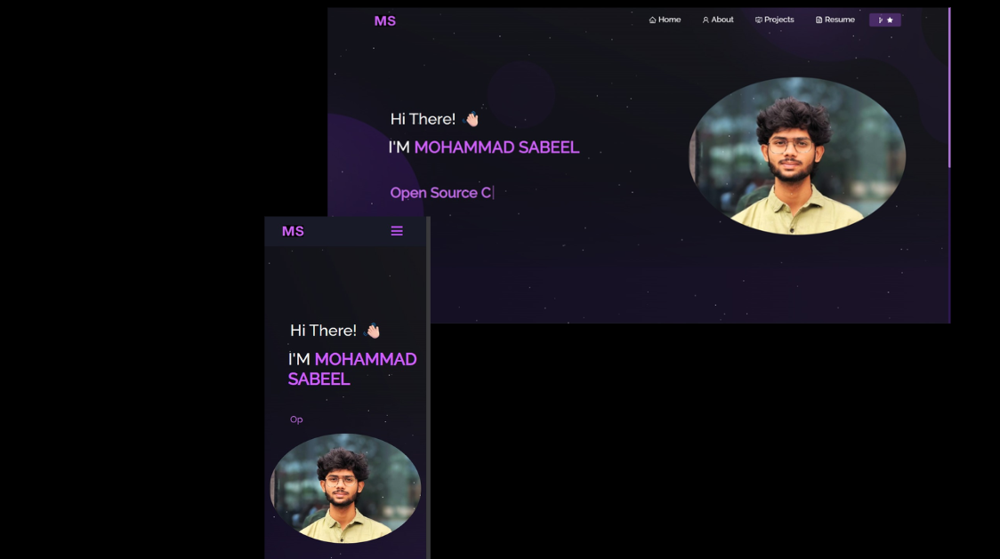

<h2 align="center">
  Portfolio Website - v2.0 
  <a href="https://portfolio-gold-delta-83.vercel.app/" target="_blank">MOHAMMAD SABEEL </a>
</h2>

  

 

 &nbsp;
 &nbsp;
 &nbsp;

<h3 align="center">
    🔹
    <a href="https://github.com/shaik-sabeel/Portfolio/issues">Report Bug</a> &nbsp; &nbsp;
    🔹
    <a href="https://github.com/shaik-sabeel/Portfolio/issues">Request Feature</a>
</h3>

## Built With

My personal portfolio <a href="https://portfolio-gold-delta-83.vercel.app/" target="_blank">soumyajit.tech</a> which features some of my github projects as well as my resume and technical skills. 

This project was built using these technologies.

- React.js
- Node.js
- Express.js
- CSS3
- VsCode
- Vercel

## Features

**📖 Multi-Page Layout**

**🎨 Styled with React-Bootstrap and Css with easy to customize colors**

**📱 Fully Responsive**

<!-- ### Show your support

Give a ⭐ if you like this website!

 -->
